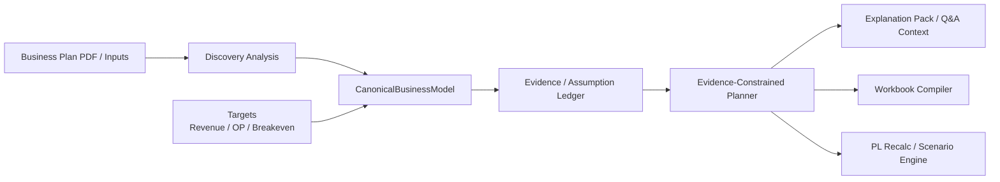

# Canonical Business Model And Evidence-Constrained Planning Design

## Goal

事業計画 PDF と目標数値から、説明責任を保ったまま一般化された事業モデルを構築し、PL、Excel、Q&A、シミュレーションへ接続できる中間アーキテクチャを導入する。

## Problem Statement

現行の `Financial-Model` は次の強みを持つ。

- PDF から事業構造や財務目標を読む分析器がある
- Excel テンプレ生成機能がある
- PL 再計算とシミュレーションの土台がある
- Q&A 画面があり、投資家・銀行・経営陣向けの説明文を作れる

一方で、一般化を難しくしている構造的な問題がある。

- `services/api/app/routers/recalc.py` は早い段階で `revenue_fy1`, `growth_rate`, `cogs_rate`, `opex_base` のようなフラットな財務キーに潰してしまう
- セグメントごとの計算は fallback として単純成長に寄りやすく、事業構造の違いを保持しづらい
- 抽出例やテンプレ設計が SaaS や既存事例に引っ張られやすい
- Q&A は現時点では PLContext と benchmark ベースの生成で、各数値の provenance と完全には接続していない

結果として、特定事例には対応できても、「様々なモデルに適応できる一般化された事業モデル」を表現しづらい。

## Design Principles

1. 業界ではなく `事業ドライバー構造` を中核にする
2. `事実`, `推定`, `経営判断`, `逆算結果` を混ぜない
3. Excel はモデル本体ではなく `出力先` にする
4. Planner は帳尻合わせをせず、根拠レンジと制約の中でしか数値を動かさない
5. Q&A は後段の見せ方ではなく、モデル品質の制約条件にする

## Target Architecture

### Stage Responsibilities

- `Discovery Analysis`
  - 既存の `BusinessModelAnalysis` を活用
  - 文書から事業構造、財務目標、開発テーマ、引用 evidence を抽出

- `CanonicalBusinessModel`
  - 業界非依存の中間表現
  - segment / engine / driver / cost pool / target / binding を保持

- `Evidence / Assumption Ledger`
  - 各重要数値の provenance、allowed_range、review_status、board_ready を保持

- `Evidence-Constrained Planner`
  - 目標達成のために逆算するが、根拠レンジ外には出ない
  - infeasible な場合は数字を捏造せず、制約違反を返す

- `Explanation Pack / Q&A Context`
  - 役員・投資家向け説明用に、主要前提・根拠・制約・感応度を構造化

- `Workbook Compiler / PL Recalc / Scenario Engine`
  - 中間表現から Excel、PL、シミュレーションへ落とす

## New Core Models

### 1. CanonicalBusinessModel

追加先:

- `src/domain/canonical_model.py`

責務:

- 事業構造と財務構造の共通表現
- Excel 非依存
- FAM、SaaS、教育、コンサル、Marketplace などを同じ器に入れる

主要モデル:

- `ModelMetadata`
- `FinancialTargets`
- `BusinessSegment`
- `RevenueEngine`
- `Driver`
- `CostPool`
- `BindingSpec`
- `CanonicalBusinessModel`

#### Key Rules

- `revenue_fy1` や `growth_rate` は最上位の唯一表現にしない
- segment と engine を分ける
- driver は `source`, `confidence`, `mode`, `decision_required` を持てるようにする
- binding は sheet/cell への割当を別管理にする

### 2. Evidence / Assumption Ledger

追加先:

- `src/domain/evidence_ledger.py`

責務:

- 重要前提の provenance を保持
- Planner と Q&A が共通で参照する単一の台帳になる

主要モデル:

- `EvidenceRef`
- `ValueRange`
- `AssumptionRecord`
- `AssumptionLedger`

#### Required Fields

- `source_type`
  - `document`
  - `historical_actual`
  - `benchmark`
  - `internal_case`
  - `management_decision`
  - `solver_derived`
  - `manual_input`
  - `default`
- `evidence_refs`
- `allowed_range`
- `confidence`
- `review_status`
- `board_ready`
- `explanation`

## Revenue Engine Plugin Boundary

追加先:

- `src/engines/base.py`
- `src/engines/subscription.py`
- `src/engines/unit_economics.py`
- `src/engines/progression.py`
- `src/engines/project_capacity.py`

既存の `services/api/app/routers/recalc.py` の archetype 計算は、段階的にここへ移す。

最初に対応する engine type:

- `subscription`
- `unit_economics`
- `progression`
- `project_capacity`

後続で追加:

- `marketplace`
- `usage`
- `advertising`
- `licensing`
- `custom_formula`

#### Engine Interface

各 engine は共通で次を返す。

- annual revenue series
- annual variable cost series
- annual gross profit series
- required driver names
- capacity/constraint hints

## Planner Semantics

追加先:

- `src/solver/planner.py`
- `src/solver/constraints.py`

Planner は `Target Solver` ではなく `Evidence-Constrained Planner` として実装する。

### Driver Modes

- `fixed`
- `bounded`
- `solve_for`
- `derived`

### Planner Rules

1. `board_ready = true` の前提は原則固定
2. `allowed_range` がある前提だけを動かす
3. `decision_required` は勝手に埋めない
4. 目標未達なら `infeasible` を返す
5. 制約違反を explanation に含める

### Planner Output

- `solved_driver_values`
- `constraint_violations`
- `feasibility`
  - `solved`
  - `partially_feasible`
  - `infeasible`
- `explanation`
- `sensitivity_hints`

## Explanation Pack And Q&A

追加先:

- `src/explain/explanation_pack.py`

変更先:

- `apps/web/src/data/qaTemplates.ts`

役割:

- ledger と planner の結果から、Q&A で必要な説明材料を構築する
- `PLContext` のみでは持てない provenance, allowed_range, constraint を追加する

必須出力:

- 結論
- 主要ドライバー 3〜5 個
- 各ドライバーの根拠
- 重要制約
- ダウンサイド感応度
- board-ready 判定

## Integration Plan With Existing Files

### Reuse Without Breaking Existing Flow

- `src/agents/business_model_analyzer.py`
  - 既存の抽出ロジックは活用
  - `BusinessModelAnalysis -> CanonicalBusinessModel` の変換器を新設

- `services/api/app/routers/recalc.py`
  - 既存 endpoint は残す
  - 内部計算を段階的に canonical + engine plugin 経由へ寄せる

- `src/excel/template_v2.py`
  - workbook 生成の役割は残す
  - 入力を `CanonicalBusinessModel + planner result + bindings` に変更できるようにする

- `src/simulation/engine.py`
  - fallback の近似ロジックは段階的に廃止
  - canonical/engine ベースの simulation に差し替える

## Milestones

### Milestone 1: Domain Schema

- `CanonicalBusinessModel`
- `AssumptionLedger`
- FAM / SaaS fixture

### Milestone 2: Model Synthesizer

- `BusinessModelAnalysis -> CanonicalBusinessModel`
- `BusinessModelAnalysis -> AssumptionLedger`

### Milestone 3: Engine Plugins

- 4 engine を `src/engines/` に分離

### Milestone 4: Planner

- root cause を隠さない evidence-constrained planner

### Milestone 5: Explanation Pack

- Q&A と説明責任を ledger ベースに接続

### Milestone 6: Workbook / Recalc / Simulation Integration

- canonical から workbook / PL / simulation へ接続

## Success Criteria

1. FAM と SaaS を同じ schema に落とせる
2. 各重要 driver に provenance を持たせられる
3. Planner が根拠のない値を勝手に作らない
4. `なぜ FY3 売上 3 億なのか` に構造化して答えられる
5. Excel を使う前の段階で、モデル品質を評価できる
